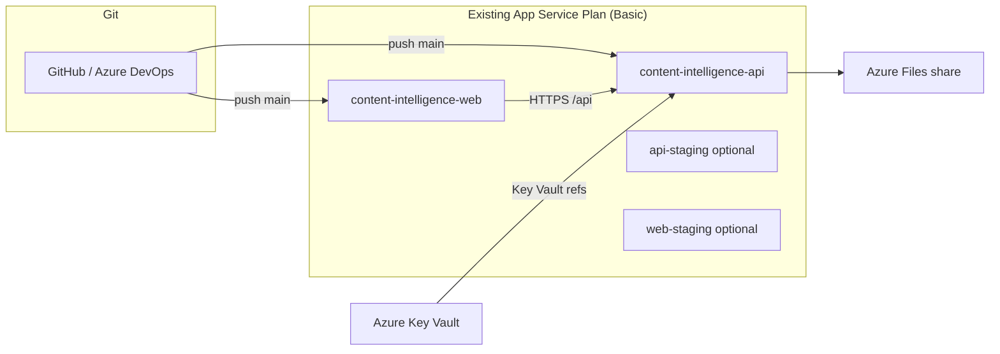

# Azure Deployment Guide

Deploy **LinkedIn Content Intelligence** onto your **existing App Service Plan** with two Linux web apps (API + frontend), GitHub or Azure DevOps CI/CD, and Azure best practices for secrets and staging.

## Architecture



| Resource | Purpose | Cost impact |
|----------|---------|-------------|
| Existing App Service Plan | Shared compute | **No new plan** |
| 2× Web Apps (API + Web) | Backend + static frontend | Included in plan quota |
| Azure Files (5 GB) | SQLite DB + generated images persistence | ~$1–2/mo |
| Key Vault (optional) | API keys, tokens | Pay per secret operation |

> **Basic tier note:** Deployment slots require **Standard (S1+)**. On Basic, use optional `-staging` web apps on the same plan (see Bicep `deployStagingApps`) or upgrade the plan when you need slot swap.

---

## 1. Provision infrastructure (Bicep)

### Prerequisites

- [Azure CLI](https://learn.microsoft.com/cli/azure/install-azure-cli) logged in: `az login`
- Existing resource group + App Service Plan name

### Deploy

```bash
cd .azure/bicep

cp main.parameters.example.json main.parameters.json
# Edit: existingAppServicePlanName, nameSuffix, frontendUrl, apiUrl

az deployment group create \
  --resource-group YOUR_RESOURCE_GROUP \
  --template-file main.bicep \
  --parameters @main.parameters.json
```

This creates:

- `content-intelligence-api-{suffix}` — Python 3.11 FastAPI
- `content-intelligence-web-{suffix}` — Node 20 static SPA host
- Azure Files mount at `/home/site/data` for SQLite + images
- Optional `-staging` apps when `deployStagingApps: true`

---

## 2. Configure secrets (App Settings + Key Vault)

**Never commit secrets.** Use Azure Portal → Web App → **Configuration**, or Key Vault references.

Copy `.azure/app-settings.example.json` as a checklist. Recommended pattern:

1. Create Key Vault in the same resource group.
2. Store `ANTHROPIC_API_KEY`, `OPENAI_API_KEY`, `X_BEARER_TOKEN`, Reddit creds, etc.
3. Enable **System-assigned managed identity** on the API app (Bicep does this).
4. Grant the identity **Key Vault Secrets User** on the vault.
5. Set app settings using `@Microsoft.KeyVault(SecretUri=...)` syntax.

Required for production:

| Setting | Where |
|---------|-------|
| `ANTHROPIC_API_KEY` | API app (Key Vault ref) |
| `CORS_ORIGINS` | API app — your frontend URL |
| `DATABASE_URL` | API app — default `sqlite:////home/site/data/content_intelligence.db` |
| `VITE_API_BASE_URL` | GitHub/Azure DevOps **build variable** (not runtime) |

Optional API keys: `OPENAI_API_KEY`, `X_*`, `REDDIT_*` — see `backend/.env.example`.

---

## 3. GitHub Actions CI/CD

### Connect repository

1. Push this repo to GitHub.
2. Run the OIDC bootstrap script (passwordless deploy):

```bash
chmod +x .azure/scripts/setup-github-oidc.sh

./.azure/scripts/setup-github-oidc.sh \
  --subscription YOUR_SUBSCRIPTION_ID \
  --resource-group YOUR_RESOURCE_GROUP \
  --github-org YOUR_GITHUB_ORG \
  --github-repo Trending_Posts_Content_Generation \
  --api-app content-intelligence-api-YOUR-SUFFIX \
  --web-app content-intelligence-web-YOUR-SUFFIX
```

3. Add the printed values to **Settings → Secrets and variables → Actions**:
   - **Secrets:** `AZURE_CLIENT_ID`, `AZURE_TENANT_ID`, `AZURE_SUBSCRIPTION_ID`
   - **Variables:** `AZURE_API_WEBAPP_NAME`, `AZURE_WEB_WEBAPP_NAME`, `VITE_API_BASE_URL`

### Workflows

| Workflow | Trigger | Deploys |
|----------|---------|---------|
| `.github/workflows/deploy-backend.yml` | `main` + `backend/**` | FastAPI to API web app |
| `.github/workflows/deploy-frontend.yml` | `main` + `frontend/**` | Vite build → Web app |

Both use **OIDC** (no long-lived publish profile secrets). Create a GitHub **environment** named `production` for approval gates if desired.

### Alternative: Azure Portal Git integration

Portal → Web App → **Deployment Center** → GitHub → authorize → select repo/branch.  
Prefer GitHub Actions for monorepo path filters and build-time `VITE_API_BASE_URL`.

---

## 4. Azure DevOps CI/CD

1. **Project → Pipelines → New pipeline** → select repo.
2. Use `azure-pipelines/azure-pipelines.yml`.
3. Create **Service connection** (Azure Resource Manager).
4. Set pipeline variables:

| Variable | Example |
|----------|---------|
| `azureServiceConnection` | `My Azure Subscription` |
| `apiWebAppName` | `content-intelligence-api-suffix` |
| `webWebAppName` | `content-intelligence-web-suffix` |
| `viteApiBaseUrl` | `https://content-intelligence-api-suffix.azurewebsites.net/api` |

5. Create **Environment** `production` with optional approvals.

---

## 5. Staging strategy (Basic plan)

| Approach | When to use |
|----------|-------------|
| `-staging` web apps (Bicep) | Zero extra plan cost; manual or branch-based deploy |
| Deployment slots | Upgrade plan to **Standard S1+**; swap staging ↔ production |
| PR preview | Separate short-lived app on same plan |

For slot-based deploys after upgrading, add a staging slot in Portal and duplicate workflows targeting `AZURE_WEBAPP_SLOT=staging`, then swap on approval.

---

## 6. Verify deployment

```bash
# API health
curl https://content-intelligence-api-YOUR-SUFFIX.azurewebsites.net/api/health

# Frontend
open https://content-intelligence-web-YOUR-SUFFIX.azurewebsites.net
```

Check **Log stream** in Portal if startup fails. Common fixes:

- API: ensure `startup.sh` is executable (CI deploys it; Bicep sets `appCommandLine`).
- Frontend: confirm `VITE_API_BASE_URL` was set at **build** time in CI variables.
- CORS: `CORS_ORIGINS` on API must exactly match frontend origin (no trailing slash mismatch).

---

## 7. Scaling & cost tips

- **Reuse the shared plan** — multiple web apps share one plan’s CPU/RAM; watch aggregate usage.
- **Always On** — unavailable on Basic; upgrade to Standard if cold starts hurt UX.
- **Database** — SQLite + Azure Files works for low traffic; migrate to **Azure Database for PostgreSQL Flexible Server** by changing `DATABASE_URL` when you need HA or concurrent writes.
- **Images** — generated images persist on the mounted share; consider Azure Blob Storage for larger scale.

---

## File reference

```
.azure/
├── bicep/main.bicep              # Web apps on existing plan + file share
├── bicep/main.parameters.example.json
├── app-settings.example.json     # Secrets / variables checklist
├── scripts/setup-github-oidc.sh  # Federated credential bootstrap
└── DEPLOYMENT.md                 # This guide
.github/workflows/
├── deploy-backend.yml
└── deploy-frontend.yml
azure-pipelines/azure-pipelines.yml
backend/startup.sh                # gunicorn + uvicorn workers
frontend/startup.sh                 # serve SPA
```
